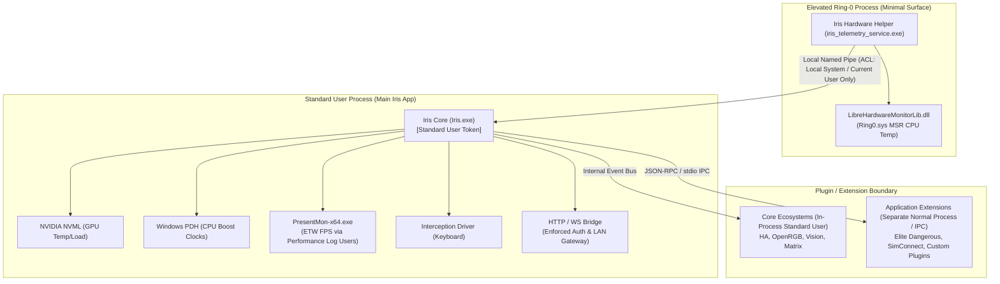

# Security Architecture Review & Privilege Separation Implementation Plan

## Executive Summary

Iris currently runs elevated primarily because **Ring-0 hardware drivers (specifically LibreHardwareMonitor's kernel driver for CPU Package temperature via MSR/SMU)** require administrator privileges to load and read model-specific CPU registers. In contrast, GPU telemetry (NVML), CPU boost clock tracking (Windows PDH), game FPS (PresentMon ETW traces via `Performance Log Users` membership), and the Interception keyboard driver do **not** require administrator privileges when configured properly.

Because the main process runs elevated:
1. Every plugin running in-process inherits administrator privileges and full OS access.
2. The internal web server and WebSocket bridge run elevated.
3. Any remote trigger from the local network (LAN) can execute local applications via `_open_path` / `execute_slot`.
4. Authentication bypasses exist on the LAN interface: unauthenticated LAN clients can connect to WebSocket when `lan_access` is on, and library images are served without session validation.

This plan details a pragmatic, hardened security architecture that **demotes Iris to standard user privileges**, isolates elevated CPU temperature probing into a **tiny, minimal IPC helper**, secures the LAN gateway, and establishes realistic process boundaries for plugins without turning Iris into an over-engineered enterprise product.

---

## Technical Audit Findings (Confirmed Against Current Repository)

### A. Why Iris Requests / Runs with Administrator Privileges
- **Installer Level** ([`Iris_Setup.iss`](file:///D:/Iris/iris_3_0/Iris_Setup.iss)): Sets `PrivilegesRequired=admin` because it installs files to `{autopf}\Iris` (Program Files) and installs the Interception driver (`install-interception.exe`).
- **Runtime Level**: When launched, Iris checks `ctypes.windll.shell32.IsUserAnAdmin()` in [`app/telemetry/collector.py`](file:///D:/Iris/iris_3_0/app/telemetry/collector.py). When Iris is launched as admin, the entire application, Tkinter UI, web server, and all loaded plugins run with full Administrator privileges.

### B. Hardware Telemetry Operations: Which Genuinely Require Elevation?
Through empirical testing on standard Windows user accounts:
1. **CPU Temperature (`LibreHardwareMonitorLib.dll`)**: **REQUIRES ELEVATION**.
   - Verified empirically: In a non-admin session, `LhmManager.read()` reports `cpu_temp: None` and `Temperature Core (Tctl/Tdie): 0.0`. LHM's kernel driver (`WinRing0` / `Ring0.sys`) cannot open MSRs or SMU registers without admin.
2. **GPU Telemetry (`pynvml` / `nvml.dll`)**: **DOES NOT REQUIRE ELEVATION**.
   - Verified empirically: `NvmlManager.read()` returns full core temp (41.0°C), memory junction temp, GPU load, core MHz, VRAM usage, and wattage under standard user privileges.
3. **CPU Frequency & Boost Ratio (Windows PDH)**: **DOES NOT REQUIRE ELEVATION**.
   - Verified empirically: `CpuFreqTracker` using Windows Performance Data Helper (`\Processor Information\% Processor Performance`) queries hardware boost frequencies at standard user privileges.
4. **Game FPS Tracking (`PresentMon-x64.exe`)**: **DOES NOT REQUIRE ELEVATION** (when in `Performance Log Users`).
   - Verified empirically: PresentMon successfully spawns and opens its ETW session as standard user when the user is in the `Performance Log Users` group (SID `S-1-5-32-559`), which our installer now configures automatically.
5. **Keystroke Injection (Interception Driver)**: **DOES NOT REQUIRE ELEVATION**.
   - Verified empirically: `interception_create_context()` returns a valid driver handle (`0x2030988ddd0`) and sends keystrokes under a standard user account once the driver is installed.

> [!IMPORTANT]
> **Key Finding**: Only **one single metric** in the entire application genuinely requires elevation: **CPU Package/Core temperature from Ring-0 MSR registers via LibreHardwareMonitor**. Everything else runs normally as a standard user.

### C. What Currently Runs Inside the Elevated Process
**Everything**:
- Python runtime, Tkinter GUI, and tray icon.
- pywebview / Edge WebView2 child processes.
- The HTTP server and WebSocket bridge on ports 15500 & 15501.
- All plugins: `ha` (Home Assistant), `rgb` (OpenRGB), `elite_dangerous`, `vision` (screen capture), `pc_stats`, `akp02_stats`.
- Local application launcher: [`app/panel_runtime.py:_open_path()`](file:///D:/Iris/iris_3_0/app/panel_runtime.py) (`subprocess.Popen` and `os.startfile`).

### D & E. Plugin Execution Capabilities & In-Process Model
- Loaded via [`app/plugin_manager.py:load_plugin()`](file:///D:/Iris/iris_3_0/app/plugin_manager.py) using `importlib.import_module()` or direct `exec_module()` from `Documents/Iris/plugins/<name>/plugin.py`.
- **Capabilities**:
  - Run arbitrary Python code in the host process.
  - Can spawn arbitrary child processes (`subprocess.Popen`, `os.system`).
  - Read/write the entire filesystem and Windows Registry with whatever privileges Iris has (currently Administrator).
  - Modify Iris in-memory state, hook other plugins, or intercept network traffic.
  - Make arbitrary network connections (LAN and WAN).

### F. Every Existing IPC & Network Boundary
1. **Loopback HTTP/WebSocket Bridge**: Ports 15500 (HTTP) & 15501 (WS). Binds to `127.0.0.1` by default; binds to `0.0.0.0` when `lan_access: true`.
2. **Serial USB Port**: COM port communication with MAX7219 matrix display via `serial.Serial`.
3. **Shared Memory**:
   - `RTSSSharedMemoryV2` (read-only mapping).
   - `MAHMSharedMemory` (MSI Afterburner, read-only mapping).
4. **Named Pipes / Child Process stdio**:
   - PresentMon spawned via `subprocess.Popen(stdout=subprocess.PIPE, stderr=subprocess.PIPE)`.

### I & J. LAN Security & Authentication Audit (Confirmed Vulnerabilities)
1. **WebSocket Unauthenticated LAN Access**:
   In [`app/ws_bridge.py:_ws_process_request()`](file:///D:/Iris/iris_3_0/app/ws_bridge.py#L202-L206):
   ```python
   try:
       if _app is not None and _app.cfg.get("lan_access", True):
           return None  # <--- AUTHENTICATION BYPASS: If lan_access is True, all peers bypass auth!
   except Exception:
       pass
   ```
   **Vulnerability Confirmed**: When LAN access is enabled, any device on the Wi-Fi/LAN can establish a raw WebSocket connection with zero password, token, or session cookie. They receive live telemetry, notifications, and button state broadcasts.
2. **Library Image Auth Bypass**:
   In [`app/ws_bridge.py:do_GET()`](file:///D:/Iris/iris_3_0/app/ws_bridge.py#L409-L417):
   ```python
   if self.path.startswith("/api/library/image/") or self.path.startswith("/api/mdi/font"):
       if not self._host_ok():
           self._reject_unauthorized()
           return
       ...
       self._handle_library_image(self.path[len("/api/library/image/"):])
       return
   ```
   When `lan_access` is enabled, `_host_ok()` returns `True` unconditionally. Therefore, **any unauthenticated LAN peer can retrieve user screenshots and library images** without providing a token or session cookie.
3. **Dangerous Endpoints Exposed to Remote LAN Peers**:
   - `POST /api/panel/action`: Calls `execute_slot()`. While [`app/server/panel.py`](file:///D:/Iris/iris_3_0/app/server/panel.py#L338-L344) has an `is_authorized_slot` validation, if a user has configured a button that launches `cmd.exe` or a backup script, a paired LAN device can trigger that executable on the host PC.
   - `POST /api/plugins/open_folder` & `POST /api/dialog/browse`: Correctly guarded by `_is_loopback_peer()`.
   - `POST /api/config`: Guarded by `_authorized()`, but if session authentication is bypassed or weakly paired, settings (including shell commands and startup items) can be altered.

---

## Target Security Architecture



### Key Principles of this Design:
1. **Main App Demoted**: `Iris.exe` runs under standard user credentials at all times.
2. **Minimal Privileged Helper**: A tiny helper process (`iris_telemetry_service.exe` or standalone script) runs elevated solely to read CPU package temperature from LHM and output flat JSON over a secured Windows Named Pipe.
3. **Realistic Plugin Isolation**:
   - Built-in core integrations (`ha`, `openrgb`, `vision`, `matrix`) run in the main process at standard user privilege.
   - External/user-installed plugins run out-of-process in a standard user child process communicating via a strict JSON-RPC message boundary. No plugin ever gets admin rights.
4. **Hardened LAN Gateway**: Fixes the WebSocket and library image bypasses immediately. All LAN requests must hold a cryptographically verified paired session token.

---

## Phased Implementation Plan

### Phase 1: Fix LAN Authentication & Authorization Bypasses (Immediate Risk Reduction)
**Objective**: Guarantee that enabling LAN access never exposes unauthenticated access to WebSockets, library images, or control APIs.

- **Current Architecture**:
  - `_ws_process_request` in `ws_bridge.py` allows connections if `lan_access` is True.
  - `/api/library/image/` in `ws_bridge.py` skips `_authorized()` checking.
- **Proposed Architecture**:
  - `_ws_process_request` MUST require a valid session cookie (`iris_session`), `X-Iris-Session` header, `token` query param, or loopback origin.
  - `/api/library/image/<filename>` MUST require a valid session cookie or token query parameter (`?token=...`), ensuring `` tags on paired mobile devices can load images while unauthorized LAN scanners are rejected with HTTP 401.
  - Explicitly restrict `_is_loopback_peer()` verification to prevent header spoofing.
- **Exact Files Changed**:
  - [`app/ws_bridge.py`](file:///D:/Iris/iris_3_0/app/ws_bridge.py): Remove the `lan_access` bypass in `_ws_process_request`; require session check on `/api/library/image/`.
  - [`app/server/auth.py`](file:///D:/Iris/iris_3_0/app/server/auth.py): Add query parameter token validation helper for media/image requests.
  - [`HTML/script.js`](file:///D:/Iris/iris_3_0/HTML/script.js): Ensure image URLs include token query parameter when running on paired LAN client.
- **Security Benefit**: Eliminates eavesdropping on live telemetry, unauthorized control triggers, and exposure of screenshots to local network devices.
- **Independently Commit-able**: **Yes**. Can be deployed immediately with zero architectural disruption.

---

### Phase 2: Demote Main Iris Application to Standard User Privileges
**Objective**: Ensure `Iris.exe` launches with standard user privileges on startup, desktop shortcut launch, and installer finish.

- **Current Architecture**:
  - [`Iris_Setup.iss`](file:///D:/Iris/iris_3_0/Iris_Setup.iss) writes startup entry to `HKLM\...\Run` and runs Iris post-install via `runascurrentuser`.
  - Users frequently launch Iris as Administrator or configure "Run as administrator" to get CPU temperatures.
- **Proposed Architecture**:
  - Remove all requirements or prompts for `Iris.exe` to run elevated.
  - Store autostart in `HKCU\Software\Microsoft\Windows\CurrentVersion\Run` (managed by [`app/startup.py`](file:///D:/Iris/iris_3_0/app/startup.py)).
  - If a user attempts to launch `Iris.exe` elevated, Iris logs a warning and informs the user that elevation is no longer needed.
- **Exact Files Changed**:
  - [`Iris_Setup.iss`](file:///D:/Iris/iris_3_0/Iris_Setup.iss): Configure per-user run key in HKCU or task without highest available privileges.
  - [`app/main.py`](file:///D:/Iris/iris_3_0/app/main.py): Ensure DPI awareness, process mitigations, and socket binding function smoothly under standard user account.
  - [`app/startup.py`](file:///D:/Iris/iris_3_0/app/startup.py): Standard user registry verification.
- **Security Benefit**: Prevents Iris, its web view, and all standard operations from having write access to `C:\Windows`, `C:\Program Files`, or system-wide registry hives.
- **Independently Commit-able**: **Yes**.

---

### Phase 3: Create Minimal Privileged Telemetry Helper Service
**Objective**: Isolate the single operation that requires Ring-0 driver access (CPU package temperature via LibreHardwareMonitor) into a lightweight, elevated helper process, communicating over a secured IPC channel.

- **Current Architecture**:
  - [`app/telemetry/lhm.py`](file:///D:/Iris/iris_3_0/app/telemetry/lhm.py) loads `LibreHardwareMonitorLib.dll` directly into the main process.
  - When non-admin, CPU temperature fails and falls back to CPU usage percentage.
- **Proposed Architecture**:
  - **`iris_hw_service.exe`** (or a scheduled elevated background task):
    - Minimal C# or Python compiled executable (~100 lines).
    - Starts as an elevated Windows Service (or Task Scheduler task configured at install time).
    - Sole responsibility: loads `LibreHardwareMonitorLib.dll`, reads CPU temperature once per second, and serves it over a Windows Named Pipe (`\\.\pipe\IrisHardwareTelemetry`).
    - **Named Pipe Security**: Protected with a strict Security Descriptor (DACL) that permits only read access by the current logged-in user SID and Local System.
  - In `app/telemetry/lhm.py`:
    - Check if running as admin. If yes (e.g. during dev), read directly.
    - If standard user, connect to `\\.\pipe\IrisHardwareTelemetry`.
    - If helper is not installed/running, gracefully fall back to GPU temp + CPU load (system continues functioning cleanly without crashing).
- **Exact Files Changed**:
  - `helper/hw_service.py` (or C# equivalent): **[NEW]** Tiny elevated service daemon.
  - [`app/telemetry/lhm.py`](file:///D:/Iris/iris_3_0/app/telemetry/lhm.py): Connect to local named pipe when unprivileged.
  - [`app/telemetry/collector.py`](file:///D:/Iris/iris_3_0/app/telemetry/collector.py): Ingest CPU temp from helper.
  - [`Iris_Setup.iss`](file:///D:/Iris/iris_3_0/Iris_Setup.iss): Register the elevated helper service during setup (only requires admin once at install time).
- **Security Benefit**:
  - Reduces the privileged codebase from 50,000+ lines (Python, UI, WebView2, web server, plugins) down to **less than 150 lines** of isolated driver-reading code.
  - Even if Iris, WebView2, or a plugin is completely compromised, the attacker only has standard user rights.
- **Independently Commit-able**: **Yes**.

---

### Phase 4: Isolate Application Extensions / Plugins Out-of-Process
**Objective**: Prevent user-installed plugins and community scripts from executing in-process inside Iris Core.

- **Current Architecture**:
  - `plugin_manager.py` imports plugin files directly into the main process address space using `importlib`.
  - A crash, infinite loop, or malicious call in a plugin directly halts or compromises Iris.
- **Pragmatic Security Boundary**:
  - *Fake Python sandboxing* (e.g. `__builtins__` filtering) is trivial to escape via object traversal (`''.__class__.__mro__...`).
  - *Enterprise containerization* (Docker, Windows AppContainers) is far too heavyweight for a fast gaming utility.
  - **The Right Balance for Iris**: **Subprocess Process-Level Isolation with Standard User Token**.
    - User plugins (`Documents/Iris/plugins/*`) execute inside a dedicated child Python runner: `python -m iris_plugin_host --plugin <name>`.
    - Communication over local standard input/output (stdio) or JSON-RPC.
    - Contract:
      - Plugin runner implements `start()`, `stop()`, `poll()`, and `on_tap()`.
      - Exposes clean JSON: `{ "type": "poll", "data": {...} }`.
      - Core app passes event payloads to plugin stdin: `{ "action": "tap", "control": "btn_1" }`.
- **Security Benefit**:
  - Complete memory isolation: a buggy or crashing plugin cannot bring down Iris, corrupt Iris memory, or steal in-memory tokens.
  - Plugins run strictly as a standard user and cannot access Iris's internal UI threads or driver contexts.
  - If a plugin misbehaves, the main app can terminate its process cleanly (`psutil.Process(pid).terminate()`).
- **Compatibility Risk**:
  - Plugins that relied on mutating Iris's internal `_app` state directly must use declarative contracts.
  - Existing official plugins (`elite_dangerous`, `ha`, `rgb`, `pc_stats`) will be audited to conform to the declarative JSON entity bus contract.
- **Exact Files Changed**:
  - `app/plugin_host.py`: **[NEW]** Lightweight out-of-process runner.
  - [`app/plugin_manager.py`](file:///D:/Iris/iris_3_0/app/plugin_manager.py): Spawn external plugins via subprocess; bridge `poll()` and `on_tap()` over stdio JSON-RPC.
- **Independently Commit-able**: **Yes**.

---

### Phase 5: LAN HTTPS / WSS Communication Architecture
**Objective**: Encrypt traffic and prevent local network credential snooping between Iris and mobile devices, without breaking local usability.

- **The Reality of Local HTTPS**:
  - Browsers (Chrome, Safari, Edge) refuse self-signed certificates without explicit installation and trust.
  - Unlike a desktop PC where an installer can run `certutil -addstore Root ca.crt`, iOS and Android will **never** automatically trust a certificate installed on the host PC. Mobile users must download a profile and manually enable full trust in device settings.
- **The Pragmatic Solution**:
  1. **Dual-Stack Server (HTTP + HTTPS)**:
     - Keep standard HTTP/WS accessible on LAN for zero-friction setup.
     - Provide an optional HTTPS/WSS toggle for security-conscious users.
  2. **Automated Local CA & Ephemeral Host Cert**:
     - At install or first run, generate an Iris Local Certificate Authority:
       - `ca.key` (kept secure on host) and `ca.crt`.
       - Issue server certificate with SANs: `DNS:localhost`, `IP:127.0.0.1`, and dynamic `IP:<lan_ip>`.
     - PC Trust: Installer imports `ca.crt` into Windows `Root` store (`certutil -addstore -f "ROOT" ca.crt`). WebView2 immediately trusts it with zero warnings.
     - Mobile Pairing Flow:
       - On the Network & Security settings tab, provide a **"Download CA Certificate"** button or QR code (`GET /api/cert/ca.crt`).
       - Clear, 2-step setup instructions for iOS (Profiles $\rightarrow$ Trust Root) and Android (Install Certificate $\rightarrow$ VPN & app user certificate).
  3. **WSS / Secure Cookies**:
     - When accessed over HTTPS, set `Secure; SameSite=Lax` cookies.
     - Upgrade WebSocket connections to `wss://`.
- **Exact Files Changed**:
  - `app/server/tls.py`: **[NEW]** TLS certificate generation and lifecycle manager using Python `cryptography` library.
  - [`app/ws_bridge.py`](file:///D:/Iris/iris_3_0/app/ws_bridge.py): Wrap sockets with `ssl.SSLContext`.
  - [`app/server/network.py`](file:///D:/Iris/iris_3_0/app/server/network.py): Dynamic SAN updates on LAN IP change.
  - [`HTML/script.js`](file:///D:/Iris/iris_3_0/HTML/script.js): Support WSS / HTTPS detection and CA download prompt.
- **Security Benefit**: Protects mobile companion passwords and tokens against packet sniffing on shared or untrusted Wi-Fi networks.
- **Independently Commit-able**: **Yes**.

---

## Prioritised Implementation Order & Complexity Matrix

| Phase | Description | Risk Addressed | Complexity | Dependencies |
| :---: | :--- | :--- | :---: | :--- |
| **1** | **Fix LAN Auth & Image Bypasses** | Network eavesdropping, unauthorized triggers, screenshot leakage | **Low** | None (Fixes immediately) |
| **2** | **Demote Main Iris Process to Standard User** | Entire app & plugins running elevated | **Low–Medium** | Installer update |
| **3** | **Isolated Ring-0 Telemetry Helper** | Retaining CPU package temp without elevating Iris Core | **Medium** | Windows service/task setup |
| **4** | **Subprocess Plugin Isolation** | In-process plugin compromise / crash vulnerability | **Medium** | IPC bridge in plugin_manager |
| **5** | **LAN HTTPS & WSS Architecture** | Cleartext LAN token transmission | **Medium–High** | TLS cert generation & mobile UX |

---

## Verification & Testing Strategy

1. **LAN Auth Verification**:
   - Send unauthenticated `GET /api/library/image/test.png` $\rightarrow$ verify HTTP 401.
   - Initiate unauthenticated `ws://<lan_ip>:15501` $\rightarrow$ verify immediate connection drop with HTTP 401.
   - Authenticate paired phone via QR code $\rightarrow$ verify full real-time access.
2. **Standard User Telemetry Verification**:
   - Launch Iris non-elevated:
     - Verify GPU temperature & power via NVML.
     - Verify CPU frequency & boost clocks via PDH.
     - Verify game FPS via PresentMon ETW trace under `Performance Log Users`.
     - Verify hardware keystroke injection via Interception driver context.
3. **Privileged Helper Verification**:
   - Connect non-elevated Iris to `\\.\pipe\IrisHardwareTelemetry` $\rightarrow$ verify CPU package temperature updates at 1 Hz with zero elevation on the main process.
4. **Plugin Isolation Verification**:
   - Deploy test plugin with `os.getpid()`, `os.environ`, and memory allocation crash $\rightarrow$ verify main Iris process remains completely unaffected and responsive.
